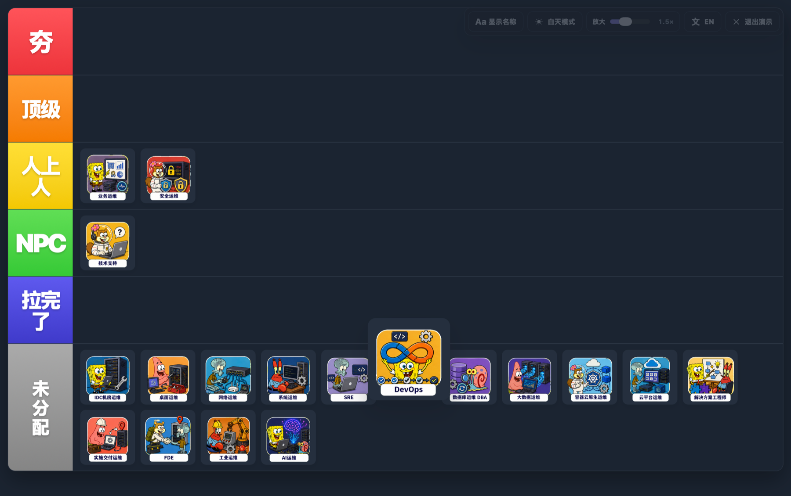

# 从夯到拉模拟器

一个无需安装、双击即可使用的图片排行工具，适合制作排行、展示和录屏。

## 主要功能

- 支持上传、拖入和粘贴多张图片
- 支持跨等级拖拽和同等级排序
- 悬浮放大倍率可在 `1.0×–2.5×` 之间调节
- 支持图片名称显示开关、白天/黑夜模式和中英文切换
- 演示模式适合干净录屏
- 图片只在浏览器本地处理，不会上传

## 使用方法

1. 下载项目。
2. 双击 `index.html` 打开。
3. 添加图片并拖入对应等级。
4. 排好后进入演示模式即可展示或录屏。

> 刷新或关闭页面会清空图片和排行；界面偏好会在浏览器允许时保存在本地。

---

# GOAT-to-Lame Tier List

A zero-setup image tier-list tool that runs directly in your browser. Upload images, drag them into tiers, and switch to presentation mode for recording.

## Features

- Upload multiple images, drag files onto the page, or paste from the clipboard
- Drag images between tiers and reorder them within a tier
- Adjustable hover zoom from `1.0×` to `2.5×`
- Show or hide image names
- Light and dark themes
- Chinese and English interfaces
- Presentation mode for clean screen recording
- Runs locally with no dependencies or uploads

## Usage

1. Download the project.
2. Double-click `index.html` to open it in your browser.
3. Add images and drag them into the desired tiers.
4. Enable presentation mode when you are ready to present or record.

> Images and rankings are stored only in the current page and will be cleared after refreshing or closing it. Interface preferences are saved locally when supported by the browser.
